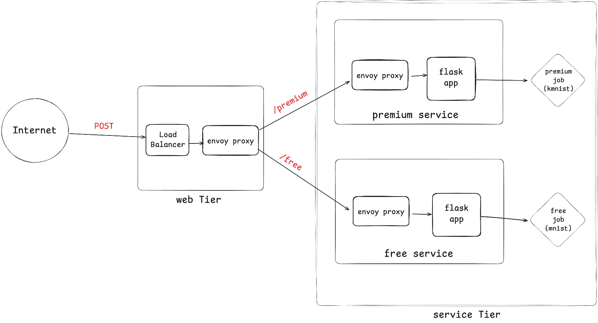

# Two-Tier ML Inference on Kubernetes (AWS EKS)

Microservice architecture deploying ML image-classification models behind a single load-balanced API on AWS EKS. A free tier (feedforward NN, MNIST) and premium tier (CNN, KMNIST) are isolated by Kubernetes namespaces with per-tier resource quotas, fronted by an Envoy traffic router.

Built for CS 498 Cloud Computing Applications (UIUC, MCS).

## Architecture



### How traffic flows

A request from the internet hits the AWS Load Balancer, which forwards it to Envoy. Envoy reads the URL and decides where to send it: `/free` goes to the free-tier Flask app, `/premium` goes to the premium-tier Flask app. The Flask app then creates a Kubernetes Job that runs the actual ML inference (one Job per request) and returns the job name. Envoy is a traffic router commonly used in Kubernetes systems; nginx could play the same role.

## Stack
- **Orchestration:** Amazon EKS, kubectl, eksctl
- **Container runtime:** Docker, DockerHub registry
- **Traffic routing:** Envoy
- **Application:** Python 3.9, Flask, PyTorch
- **Infrastructure:** AWS Network Load Balancer, EC2 (t3.medium nodes)
- **Datasets:** MNIST, KMNIST

## Key engineering decisions
- **Namespace isolation** with per-namespace `ResourceQuota` (free tier capped at 2 CPU / 2 pods) demonstrates multi-tenant resource governance.
- **Job-based inference** (one-shot Kubernetes Jobs vs long-running services) matches the bursty, stateless nature of inference workloads and lets the platform garbage-collect compute after each request.
- **Envoy at the edge** routes by URL path (`/free`, `/premium`) to the right Flask service — single public entry point, internal traffic stays in-cluster.
- **External LoadBalancer Service** maps port 80 → container 8080 (non-root Envoy listener), following standard HTTP conventions for the public surface while respecting Linux's privileged-port rules inside containers.
- **Service accounts with RBAC** scoped to each namespace let the Flask apps create Jobs without granting cluster-wide privileges.

## Repository structure
```
.
├── clusterConfig.yaml              # eksctl cluster definition
├── free_service/
│   ├── app/                         # Flask API + Dockerfile
│   ├── job/                         # Inference Job container
│   ├── free-tier-quota.yaml         # ResourceQuota (2 CPU / 2 pods)
│   ├── free-tier-service.yaml
│   ├── free_deployment.yaml
│   └── free_tier_envoy.yaml
├── premium_service/                 # mirror of free_service (no quota)
├── web_tier/
│   ├── Dockerfile.web-tier          # Envoy container
│   ├── web_tier_envoy.yaml          # routing config
│   └── web_tier_deployment.yaml     # Deployment + LoadBalancer Service
├── model_config/                    # PyTorch training & inference code
├── grader_interface.py              # Flask wrapper exposing kubectl state
└── submit.py                        # autograder client
```

## Deployment

```bash
# 1. Create the cluster
eksctl create cluster -f clusterConfig.yaml

# 2. Build and push images
docker build -t <user>/free-tier-app:latest -f free_service/app/Dockerfile.free-tier-app free_service/app
docker build -t <user>/free-tier-job:latest -f free_service/job/Dockerfile.free-tier-job free_service/job
# (same for premium-tier-app, premium-tier-job, web-tier)
docker push <user>/free-tier-app:latest
# (push the rest)

# 3. Apply manifests
kubectl apply -f free_service/free-tier-quota.yaml
kubectl apply -f free_service/free_deployment.yaml
kubectl apply -f free_service/free-tier-service.yaml
kubectl apply -f premium_service/premium_deployment.yaml
kubectl apply -f premium_service/premium-tier-service.yaml
kubectl apply -f web_tier/web_tier_deployment.yaml

# 4. Verify
kubectl get svc -n web-tier
# EXTERNAL-IP -> AWS NLB DNS
```

## Sample request
```bash
curl -X POST http://<LB-DNS>/free \
  -H "Content-Type: application/json" \
  -d '{"dataset":"mnist"}'
# {"job_name":"free-job-template-...","status":"submitted"}
```

## Tested
4/4 autograder tests passing — POST `/free`, GET `/free/resource-quota`, end-to-end free-tier Job, end-to-end premium-tier Job + log retrieval.
